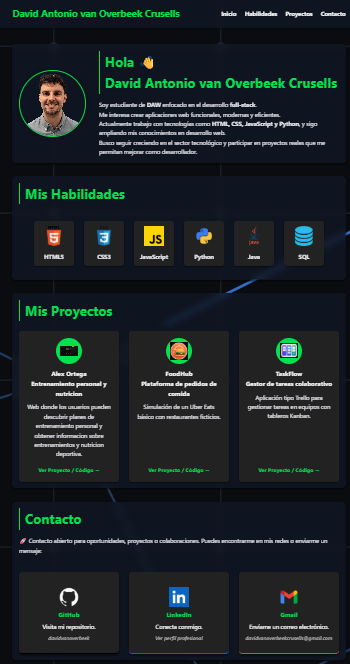

# 🌐 Portfolio - David van Overbeek Crusells

Portfolio personal desarrollado como estudiante de **DAW (Desarrollo de Aplicaciones Web)**.  
El proyecto muestra mis habilidades, tecnologías, proyectos y formas de contacto como desarrollador **full-stack en formación**.

---

## 🧑‍💻 Sobre el proyecto

Este portfolio está diseñado para ser **moderno, responsive y minimalista**, con enfoque en:

- Presentación personal profesional
- Showcase de habilidades técnicas
- Galería de proyectos
- Sección de contacto directa

---

## 📸 Vista previa

---

## 🛠️ Tecnologías utilizadas

- HTML5
- CSS3 (Flexbox + Grid + Responsive Design)
- JavaScript (Vanilla)
- Diseño responsive (Mobile First)
- UI con efectos hover y transiciones

---

## 📂 Estructura del proyecto

---

## ✨ Funcionalidades

- 🎯 Navegación suave entre secciones
- 📱 Menú hamburguesa en versión móvil
- 🎨 Diseño con efectos hover y glassmorphism
- 🧩 Grid de proyectos responsive
- 📬 Enlaces directos a GitHub, LinkedIn y correo

---

## 📁 Secciones del portfolio

- **Inicio** → Presentación personal
- **Habilidades** → Tecnologías que domino
- **Proyectos** → Proyectos ficticios y reales
- **Contacto** → Redes profesionales

---

## 📌 Proyectos incluidos

### 🧠 TaskFlow
Gestor de tareas tipo Kanban para equipos.

### 🍔 FoodHub
Simulación de plataforma de pedidos de comida.

### 🎬 CineVerse
Gestor de películas y reseñas de usuarios.

---

## 📫 Contacto

- GitHub: [davidvanoverbeek](https://github.com/davidvanoverbeek)
- LinkedIn: [davidantoniovanoverbeekcrusells](https://www.linkedin.com/in/davidantoniovanoverbeekcrusells/)
- Email: davidvanoverbeekcrusells@gmail.com

---

## ⚡ Autor

Desarrollado por **David Antonio van Overbeek Crusells**  
Estudiante de DAW enfocado en desarrollo full-stack.

---

## 📄 Licencia

Este proyecto es de uso educativo y portfolio personal.
